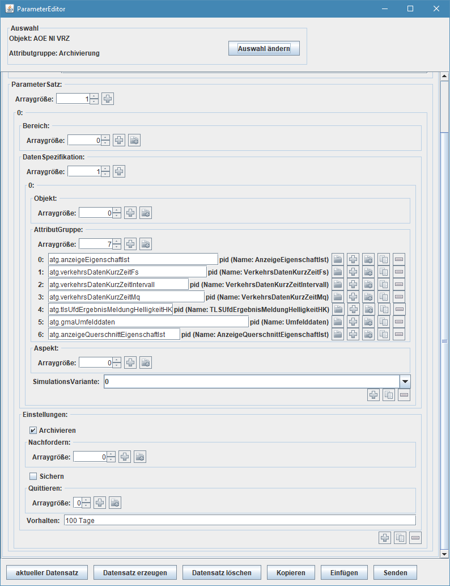

# ClientDataExchange Client

Client-Implementierung der REST API für Datenverteiler (Dav3)

## Kurzbeschreibung der Funktionalität

Die Software realisiert den Client einer REST API
 
 
## Betriebsinformationen

### Installation der Software

#### Voraussetzungen

Es muss eine Java Runtime Umgebung (JRE) ab Version 8.0 oder höher installiert und über den
Suchpfad auffindbar sein [jre].
Eine Java Runtime Umgebung (JRE) ist für den Betrieb ausreichend, jedoch bietet das Java Development
Kit (JDK) zusätzlich nützliche Tools für die Diagnose [jdk].
Die korrekte Installation von Java lässt sich auf der Kommandozeile mit folgendem Befehl überprüfen:

```
java -version
```

Erfolgt die Ausgabe der installierten Javaversion ist der Pfad korrekt eingerichtet. Erfolgt eine Meldung,
dass der Befehl nicht gefunden wurde, muss die Pfadvariable angepasst werden.
Unter Linux-Systemen (unter anderem Linux, Mac OS X) kann dies mit folgendem Kommando erfolgen:

```
export PATH=$PATH:/pfad_zu_java/bin
```

Unter Windows muss der Pfad im Dialog "Systemsteuerung/System/Erweitert/Umgebungsvariablen"
angepasst werden. Der Wert der Variablen **PATH** muss um den Text `;/pfad_zu_java/bin` ergänzt
werden.

#### Erstinstallation

Der Inhalt der ZIP-Archive der SWE muss in das Verzeichnis `$PROJEKT_HOME/lib` kopiert werden.
Unter Linux-Systemen werden die ZIP-Archive mit

```
unzip de.bitctrl.dav.rest.client-0.0.1-SNAPSHOT.zip
```

entpackt und mit

```
cp -r de.bitctrl.dav.rest.client $PROJEKT_HOME/lib
```

in den Ordner mit den Bibliotheken des Projekts kopiert.
Unter Windows kann ab Windows XP der Windows-Explorer sowohl für das Entpacken, als auch für
das Kopieren verwendet werden. Für ältere Windows-Systeme muss ein zusätzliches Tool zum Entpacken
des ZIP-Archivs verwendet werden (z.B. das kostenlose  [7-Zip](http://7-zip.org)).

#### Deinstallation der Software

Für die Deinstallation sollte die SWE gestoppt werden.

Zur Deinstallation der Software werden die Dateien und Verzeichnisse, die in Kapitel "Erstinstallation
der Software" installiert bzw. kopiert wurden, gelöscht.

Gleiches gilt für Dateien und Verzeichnisse, die bei der Installation angelegt bzw. kopiert wurden.

#### Aktualisierung der Software

Für die Aktualisierung muss die SWE gestoppt werden.

Die Aktualisierung entspricht der Deinstallation und anschließender Erstinstallation der SWE.

### Einrichtung der Software

#### Konfiguration
Folgende Konfigurationsbereiche müssen im Datenverteiler, mit dem sich die SWE verbindet vorhanden sein:
* ''kb.systemModellGlobal'' aus dem KV ''kv.kappich'', mind. in Version 38

#### Parametrierung
Die SWE benötigt zum Betrieb folgende Parameter:
* ''atg.archiv'' an einem Objekt vom Typ ''typ.archiv''

Über diese Parameterattributgruppe wird dem Archivsystem mitgeteilt, welche Datenidentifikationen (d.h. Tripel aus Objekt, Attributgruppe und Aspekt) zu einem REST Server übertragen werden sollen. Die Einstellungen für Sichern, Nachfordern und dem Vorhaltezeitraum haben keine Wirkung.

Über die Parametrierung der ''atg.archiv'' wird festgelegt, auf welche Datenidentifikationen sich die SWE anmeldet. Die Empfangenen Daten werden dann transformiert und via REST API an einen REST Server versandt.



Im dargestellten Beispiel werden die Daten der Attributgruppen `atg.anzeigeEigenschaftIst`, `atg.verkehrsDatenKurzZeitFs`, `atg.verkehrsDatenKurzZeitIntervall`, `atg.verkehrsDatenKurzZeitMq`, `atg.tlsUfdErgebnisMeldungHelligkeitHK`, `atg.gmaUmfelddaten` und `atg.anzeigeQuerschnittEigenschaftIst` versandt.


### Aufnahme des Betriebs

#### Startparameter
Die SWE verwendet die Datenverteiler - Applikationsfunktionen zur Kommunikation mit dem Datenverteiler und unterstützt bzw. benötigt daher auch die entsprechenden Aufrufparameter (siehe [Betriebsinformationen DaV](https://gitlab.nerz-ev.de/ERZ/SPEZ_de.bsvrz.kernsoftware/blob/master/06-BetrInf/BetrInf_DaV-DAF_FREI_V6.0_D2018-10-30.pdf)).

* `-objekt=<pid>` : Die PID des Applikationsobjektes (vom Typ `typ.archiv`)
* `-url=http://localhost` : Die URL des REST Servers, der Standardwert ist `http://localhost`.
* `-port=80` : Der Port des REST Servers, der Standardwert ist `9998`.

#### Unterstützte Datenspezifikationen

Folgende Datenspezifikationen werden durch den Client Unterstützt:

<table border="1">
    <tr>
      <th scope="col">Objekt Typ</th>
      <th scope="col">Attributgruppen</th>
    </tr>
    <tr>
     <td>typ.anzeige</td>
     <td>atg.anzeigeEigenschaftIst</td>
    </tr>
    <tr>
     <td>typ.anzeigeQuerschnitt</td>
     <td>atg.anzeigeQuerschnittEigenschaftIst</td>
    </tr>
    <tr>
     <td>typ.fahrStreifen</td>
     <td>atg.verkehrsDatenKurzZeitFs, atg.verkehrsDatenKurzZeitIntervall</td>
    </tr>
    <tr>
     <td>typ.messQuerschnitt</td>
     <td>atg.verkehrsDatenKurzZeitMq</td>
    </tr>
    <tr>
     <td>typ.gma</td>
     <td>atg.gmaUmfelddaten</td>
    </tr>
    <tr>
     <td>typ.deUfd</td>
     <td>atg.tlsUfdErgebnisMeldungHelligkeitHK</td>
    </tr>
</table>

Wird die SWE so parametriert, dass nicht unterstützte Datenspezifikationen konvertiert und versendet werden sollen, dann gibt es entsprechende Fehlermeldungen im Logfile, die SWE arbeitet jedoch weiter. 


## Diagnosehandbuch
### Benötigte Werkzeuge

Folgende Werkzeuge werden für eine Diagnose benötigt:

* Generischer Testmonitor (GTM) für die Überprüfung der Parametrierung
* Texteditor/Textviewer für die Analyse der Logdateien

### Allgemeine Meldungen (Startmeldungen)

Folgende Ausgaben werden im Regelfall beim Start der SWE ausgegeben (Auszug aus dem Debug-Log) und stellen einen korrekten Start und Betrieb dar (die Ausgaben der konkret eingestellten Parameter sowie insbesondere die Werte am Ende des Auszugs weichen im konkreten System ggf. hiervon ab!).

```

#000000 29.04.2019 14:49:48,916:+0200 (TID:000001) ---------------------- 
INFO : Client
Aktuelle Debugeinstellungen
----------------------------------------------
Registrierte DebugLogger: 
 Name: DEFAULT-DEBUG Level: ALL
 Name: global Level: null
 Name: Client Level: ALL
 Name: Level: INFO


#000001 29.04.2019 14:49:48,920:+0200 (TID:000001) ---------------------- 
INFO : Client
Aufrufargumente von Client: ArgumentList[-benutzer=vrz, -authentifizierung=passwd, -datenverteiler=192.168.1.169:8083, -verschluesselung=nein, -erlaubeHmacAuthentifizierung=ja, -puffer=50000000:50000000:100000000, -debugLevelStdErrText=INFO, -debugLevelFileText=INFO, -url=https://ts.dlr.de/backend/VMZDataExchangeService/, -port=443]

#000002 29.04.2019 14:49:49,035:+0200 (TID:000001) ---------------------- 
INFO : Client.de.bsvrz.dav.daf.main.ClientDavConnection
Datenverteiler-Applikationsfunktionen 'de.bsvrz.dav.daf', Release: Kernsoftware 3.11.0, Version: , Stand: 08.06.18 15:52:53

#000005 29.04.2019 14:49:49,118:+0200 (TID:000001) ---------------------- 
INFO : Client.de.bsvrz.dav.daf.communication.tcpCommunication.TCP_IP_Communication
TCP-Verbindung aktiv aufgebaut, /192.168.1.169:49218 --> /192.168.1.169:8083

#000010 29.04.2019 14:49:50,450:+0200 (TID:000001) ---------------------- 
INFO : Client.de.bsvrz.dav.daf.communication.protocol.ClientHighLevelCommunication
Verschlüsselte Verbindung aufgebaut mit: AES_128/GCM/NoPadding

#000011 29.04.2019 14:49:50,608:+0200 (TID:000001) ---------------------- 
INFO : Client.de.bsvrz.dav.daf.communication.protocol.ClientHighLevelCommunication
Verschlüsselung der Verbindung wird deaktiviert

#000016 29.04.2019 14:49:50,647:+0200 (TID:000017) ---------------------- 
INFO : Client.de.bsvrz.dav.daf.main.impl.SubscriptionManager
Die Konfiguration ist für Anfragen bereit

#000017 29.04.2019 14:49:52,126:+0200 (TID:000001) ---------------------- 
INFO : Client.de.bsvrz.dav.daf.main.impl.config.DafDataModel
Protokollversion für Konfigurationsanfragen: 2

#000064 29.04.2019 14:49:52,928:+0200 (TID:000001) ---------------------- 
INFO : Client.de.bitctrl.dav.rest.client.Dav2RestSender
Folgende Objekt-Converter wurden via Reflection gefunden: [class de.bitctrl.dav.rest.client.converter.AnzeigeJsonConverter, class de.bitctrl.dav.rest.client.converter.GlaetteMeldeAnlageJsonConverter, class de.bitctrl.dav.rest.client.converter.AnzeigeQuerschnittJsonConverter, class de.bitctrl.dav.rest.client.converter.FahrstreifenJsonConverter, class de.bitctrl.dav.rest.client.converter.SystemObjectJsonConverter, class de.bitctrl.dav.rest.client.converter.MessQuerschnittJsonConverter]

#000066 29.04.2019 14:49:52,943:+0200 (TID:000001) ---------------------- 
INFO : Client.de.bitctrl.dav.rest.client.Dav2RestSender
Anmeldung am Datenverteiler abgeschlossen, jetzt gehts los...

#001027 29.04.2019 14:50:24,613:+0200 (TID:000024) ---------------------- 
INFO : Client.de.bitctrl.dav.rest.client.Dav2RestSender
Neue Archivparameter eingelesen - Beginne mit Anmeldung/Ummeldung für Archivparameter. Es werden 35785 Anmeldungen und 0 Abmeldungen vorgenommen.

#001028 29.04.2019 14:50:25,678:+0200 (TID:000024) ---------------------- 
INFO : Client.de.bitctrl.dav.rest.client.Dav2RestSender
An- und Abmeldung für Archivdatensaetze abgeschlossen - 1029 ms

```

Mit Erreichen der Meldung `Anmeldung am Datenverteiler abgeschlossen, jetzt gehts los...` ist die SWE betriebsbereit.

### Allgemeine Meldungen (Info/ Konfig)

Die Meldungen im Debug-Level INFO/KONFIG erlauben die Überprüfung der korrekten Funktion der SWE zur Laufzeit.
Einträge, die im Logfile als „INFO“ gekennzeichnet sind, dienen zur Information und können dem Anwender Aufschluss über die aktuellen Aktivitäten der SWE geben.

### Warnmeldungen (WARNING)

Log-Einträge mit dem Level WARNING behindern zwar den Betrieb, verhindern ihn jedoch nicht. Es stehen jedoch nicht alle Funktionen der SWE zur Verfügung. Die Ursache einer Warnung sollte behoben werden, damit die SWE voll funktionstüchtig ist.


<table border="1">
    <tr>
      <th scope="col">Meldung</th>
      <th scope="col">Beschreibung</th>
    </tr>
    <tr>
    <td><code>Der Heap ist zu mehr als 90% belegt, es werden X Elemente aus der Warteschlange entfernt.</code></td>
    <td>Der von der SWE verwendete Speicher ist fast vollständig belegt. Damit die SWE nicht durch einen OutOfMemory Error beendet wird, werden 10% der Daten gelöscht, die bisher trotz mehrmaligem Versuch nicht versendet werden konnten.</td>
    </tr>
</table>

### Fehlermeldungen (ERROR)

Log-Einträge mit dem Level ERROR verhindern den korrekten Betrieb. Die Funktionen der SWE stehen nicht oder nur eingeschränkt zur Verfügung. Die Ursache eines Fehlers muss umgehend behoben werden, damit die SWE funktionstüchtig ist und die wichtigsten Funktionen erfüllt werden.
Einträge, die im Logfile als „FEHLER“ gekennzeichnet sind, bedürfen somit einer dringenden Analyse/Beseitigung. Ein Fehler der Kategorie „FEHLER“ bedeutet jedoch nicht automatisch, dass die SWE keine Daten mehr versendet. In der Regel können solche Fehler nicht vom Operator beseitigt werden.


<table border="1">
    <tr>
      <th scope="col">Meldung</th>
      <th scope="col">Beschreibung</th>
    </tr>
    <tr>
     <td><code>Instanziierung der Klasse X fehlgeschlagen.</code></td>
     <td>Ein Objekt der Konverter-Klasse X (ERZ Datenformat nach JSON) konnte nicht instanziiert werden. Es gibt eine Vielzahl möglicher Fehlerursachen. Es könnten z.B. Bibliotheken im Klassenpfad fehlen. Nachfolgend wird der Text der Exception mit weiteren Informationen angezeigt.</td>
    </tr>
     <td><code>DAV Objekte konnten nicht versendet werden.</code></td>
     <td>Es liegt ein allgemeines Kommunikationsproblem zum REST Server vor.</td>
    </tr>
    <tr>
     <td><code>Objekttyp-X konnten nicht versendet werden.</code></td>
     <td>Die statischen Informationen zu Objekten konnten nicht an den REST Server versandt werden. Jedoch ist eine prinzipielle Kommunikation möglich. REST Client und/oder Server sind nicht vollständig implementiert oder verwenden verschiedene Protokollversionen (RAML Schnittstellenbeschreibung). Nachfolgend wird der Text der Exception mit weiteren Informationen angezeigt.</td>
    </tr>
    <tr>
     <td><code>OnlineDaten konnten nicht für den Versand vorbereitet werden, es erfolgt kein Nachversand.</code></td>
     <td>Die Konvertierung der ERZ Daten in JSON Objekte ist fehlgeschlagen. Nachfolgend wird der Text der Exception mit weiteren Informationen angezeigt.</td>
    </tr>
    <tr>
     <td><code>Instanziierung und Konvertierung der Klasse X fehlgeschlagen (ResultData: resultData ).</code></td>
     <td>Ein Objekt der Konverter-Klasse X (ERZ Datenformat nach JSON) konnte nicht instanziiert werden. Es gibt eine Vielzahl möglicher Fehlerursachen. Es könnten z.B. Bibliotheken im Klassenpfad fehlen. Nachfolgend wird der Text der Exception mit weiteren Informationen angezeigt.</td>
    </tr>
    <tr>
     <td><code>Ermittlung des freien Heaps und das Verkürzen der Warteschlage ist fehlgeschlagen.</code></td>
     <td>Die Überwachung des freien Heap Speichers wurde mit einem Fehler abgebrochen.</td>
    </tr>
    <tr>
     <td><code>OnlineDaten konnten nicht (nach)versendet werden.</code></td>
     <td>Allgemeines Problem beim Nachversandt der Onlinedaten. Es besteht ein allgemeines Kommunikationsproblem zum REST Server.</td>
    </tr>
    <tr>
     <td><code>Archiv kann Datensatz nicht der Warteschlange hinzufügen.</code></td>
     <td>Vom ERZ Datenverteiler empfange Daten können nicht für eine Weiterverarbeitung zwischengespeichert werden. Nachfolgend wird der Text der Exception mit weiteren Informationen angezeigt.</td>
    </tr>
     <tr>
     <td><code>Der Versand von Datenart-X ist fehlgeschlagen und wird per Nachversand erneut versucht.</code></td>
     <td>Für ein bestimmtes Onlinedatum (dynamische Daten) ist der Versand zum REST Server fehlgeschlagen. Es wird versucht die Informationen später erneut zu versenden. Nachfolgend wird die HTTP Response des REST Servers angezeigt.</td>
    </tr>
    <tr>
     <td><code>Fehler beim Versand von Datenart-X es wird per Nachversand erneut versucht.</code></td>
     <td>Für ein bestimmtes Onlinedatum (dynamische Daten) ist der Versand zum REST Server fehlgeschlagen. Es wird versucht die Informationen später erneut zu versenden. Nachfolgend wird der Text der Exception mit weiteren Informationen angezeigt.</td>
    </tr>
</table>


